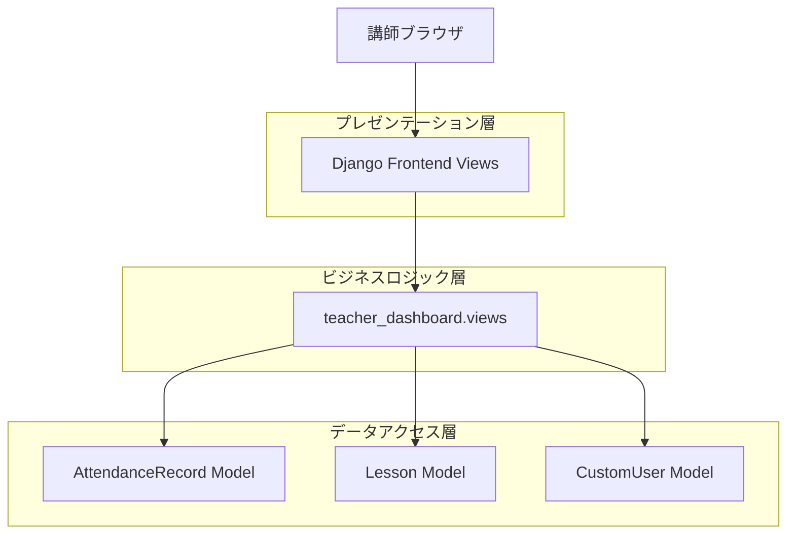
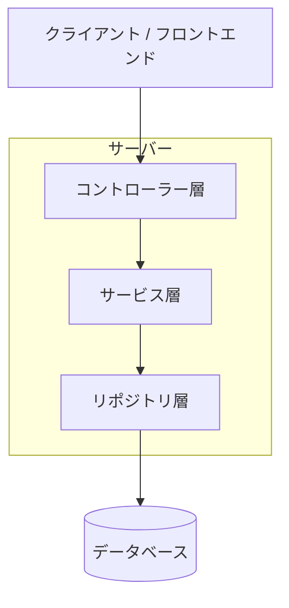
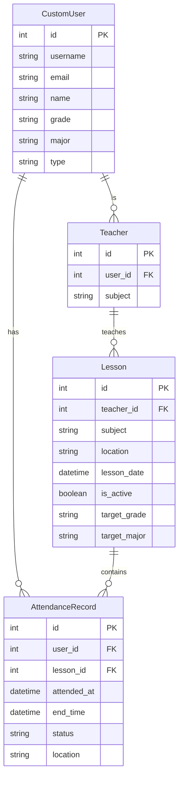

# 出席者一覧機能 技術アーキテクチャ文書

## 1. アーキテクチャ設計



## 2. 技術説明
- フロントエンド: Django Templates + Bootstrap 5 + JavaScript
- バックエンド: Django 4.x + Python 3.12
- データベース: SQLite（既存）
- 認証: Django標準認証 + カスタムデコレータ

## 3. ルート定義
| ルート | 目的 |
|--------|------|
| /teacher_dashboard/attendance_list/ | 出席者一覧ページ、授業選択と出席者表示 |
| /teacher_dashboard/attendance_list/<int:lesson_id>/ | 特定授業の出席者一覧表示 |
| /teacher_dashboard/attendance_detail/<int:record_id>/ | 個別出席記録の詳細表示 |
| /teacher_dashboard/attendance_export/<int:lesson_id>/ | 出席者データのCSVエクスポート |

## 4. API定義

### 4.1 コアAPI

出席者一覧取得
```
GET /teacher_dashboard/attendance_list/<int:lesson_id>/
```

リクエストパラメータ:
| パラメータ名 | パラメータ型 | 必須 | 説明 |
|-------------|-------------|------|------|
| lesson_id | integer | true | 授業ID |
| status | string | false | 出席状況フィルタ（present/late） |
| grade | string | false | 学年フィルタ |
| major | string | false | 専攻フィルタ |

レスポンス:
| パラメータ名 | パラメータ型 | 説明 |
|-------------|-------------|------|
| lesson | object | 授業情報 |
| attendance_records | array | 出席記録一覧 |
| total_count | integer | 総出席者数 |

CSVエクスポート
```
GET /teacher_dashboard/attendance_export/<int:lesson_id>/
```

リクエスト:
| パラメータ名 | パラメータ型 | 必須 | 説明 |
|-------------|-------------|------|------|
| lesson_id | integer | true | 授業ID |

レスポンス:
| パラメータ名 | パラメータ型 | 説明 |
|-------------|-------------|------|
| file | csv | 出席者データCSVファイル |

## 5. サーバーアーキテクチャ図



## 6. データモデル

### 6.1 データモデル定義



### 6.2 データ定義言語

既存のモデルを使用するため、新規テーブル作成は不要。

出席者一覧取得用のクエリ例:
```sql
-- 特定授業の出席者一覧を取得
SELECT 
    ar.id,
    u.username,
    u.name,
    u.grade,
    u.major,
    ar.attended_at,
    ar.end_time,
    ar.status,
    ar.location
FROM attendance_token_attendancerecord ar
JOIN accounts_customuser u ON ar.user_id = u.id
JOIN accounts_lesson l ON ar.lesson_id = l.id
JOIN accounts_teacher t ON l.teacher_id = t.id
WHERE l.id = ? AND t.user_id = ?
ORDER BY ar.attended_at DESC;

-- 授業別出席統計
SELECT 
    l.subject,
    l.lesson_date,
    COUNT(ar.id) as total_attendees,
    COUNT(CASE WHEN ar.status = 'present' THEN 1 END) as present_count,
    COUNT(CASE WHEN ar.status = 'late' THEN 1 END) as late_count
FROM accounts_lesson l
LEFT JOIN attendance_token_attendancerecord ar ON l.id = ar.lesson_id
JOIN accounts_teacher t ON l.teacher_id = t.id
WHERE t.user_id = ?
GROUP BY l.id, l.subject, l.lesson_date
ORDER BY l.lesson_date DESC;
```