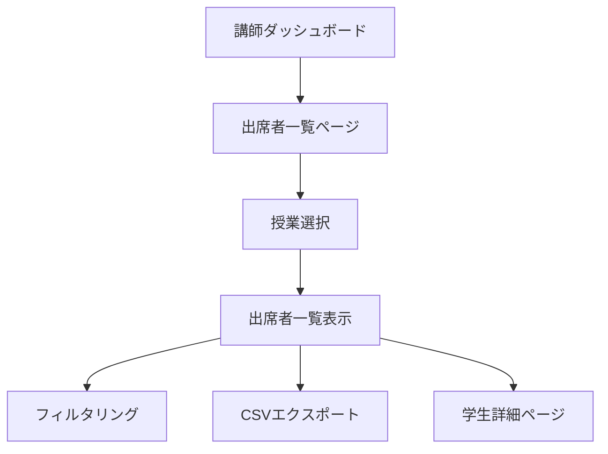

# 出席者一覧機能 要件定義書

## 1. 製品概要
講師ダッシュボードに授業の出席者一覧を確認できる機能を追加し、講師が自分の授業の出席状況を効率的に管理できるようにします。
既存のDjango出席管理システムに統合され、講師の授業運営をサポートする重要な機能として位置づけられます。

## 2. コア機能

### 2.1 ユーザー役割
| 役割 | 登録方法 | 主要権限 |
|------|----------|----------|
| 講師 | 招待コードによる登録 | 自分の授業の出席者一覧閲覧、出席状況確認、CSVエクスポート |

### 2.2 機能モジュール
出席者一覧機能は以下の主要ページで構成されます：
1. **出席者一覧ページ**: 授業選択、出席者リスト表示、フィルタリング機能
2. **出席詳細ページ**: 個別学生の出席履歴、詳細情報表示

### 2.3 ページ詳細
| ページ名 | モジュール名 | 機能説明 |
|----------|-------------|----------|
| 出席者一覧ページ | 授業選択 | 講師の担当授業一覧を表示、授業選択機能 |
| 出席者一覧ページ | 出席者リスト | 選択した授業の出席者一覧を表形式で表示、出席状況（出席/遅刻）、出席時間、終了時間を表示 |
| 出席者一覧ページ | 学生情報表示 | 学生の学年、専攻、氏名などの基本情報を表示 |
| 出席者一覧ページ | フィルタリング | 出席状況、学年、専攻による絞り込み機能 |
| 出席者一覧ページ | CSVエクスポート | 出席者データのCSV形式でのダウンロード機能 |
| 出席詳細ページ | 学生詳細情報 | 選択した学生の詳細情報と出席履歴を表示 |

## 3. コアプロセス

### 講師フロー
1. 講師がダッシュボードから「出席者一覧」を選択
2. 担当授業一覧から確認したい授業を選択
3. 選択した授業の出席者一覧が表示される
4. 必要に応じてフィルタリングや並び替えを実行
5. CSVエクスポートまたは個別学生の詳細確認を実行

## 4. ユーザーインターフェース設計

### 4.1 デザインスタイル
- プライマリカラー: #2563eb（青系）
- セカンダリカラー: #64748b（グレー系）
- ボタンスタイル: 角丸（border-radius: 6px）、ホバー効果付き
- フォント: システムフォント、本文14px、見出し18px
- レイアウトスタイル: カードベース、上部ナビゲーション
- アイコンスタイル: シンプルなアウトラインアイコン

### 4.2 ページデザイン概要
| ページ名 | モジュール名 | UI要素 |
|----------|-------------|--------|
| 出席者一覧ページ | 授業選択 | ドロップダウンメニュー、検索機能付き、選択した授業名を大きく表示 |
| 出席者一覧ページ | 出席者リスト | レスポンシブテーブル、ストライプ表示、ソート機能付きヘッダー |
| 出席者一覧ページ | フィルタリング | サイドバー形式、チェックボックス、ラジオボタン |
| 出席者一覧ページ | CSVエクスポート | 右上固定ボタン、ダウンロードアイコン付き |

### 4.3 レスポンシブ対応
デスクトップファーストで設計し、タブレット・モバイルに適応。タッチ操作に最適化されたボタンサイズとスワイプ操作をサポート。